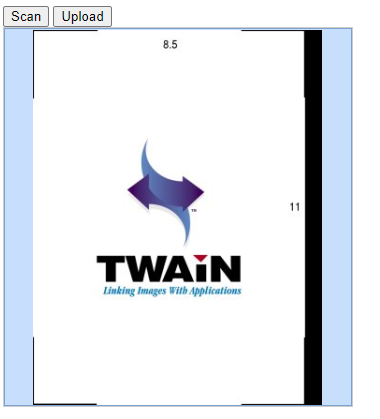
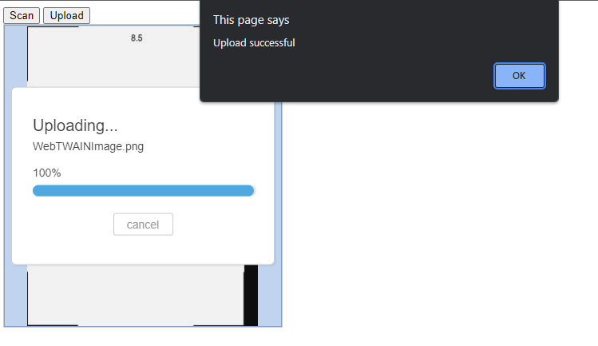

# Uploading Images to the Server

<!-- <div class='blockquote-note'></div>
> This article is part of our HelloWorld series. If you have not already reviewed HelloWorld, please start [here]({{site.getstarted}}helloworld.html) -->

In the [previous guide]({{site.getstarted}}scanning.html), we incorporated DWT scanning functionality into the HelloWorld web application. Typically, we would like to upload scanned documents to the server. Here, we demonstrate how to use DWT to upload scanned documents as a PNG file by building on HelloWorld.

> Prerequisites: Hello World - Scanning Images

## Add an Upload Button

Insert this line in the `<body>` element of `HelloWorld.html` to create a button:

```html
<input type="button" value="upload" onclick="upload();" />
```

## Define the Upload Function

Here we define an upload function, as well as its helpers. Insert the following javascript in the existing `<script>` in `HelloWorld.html`:

```JS
function upload() {
    if (DWTObject && DWTObject.HowManyImagesInBuffer > 0) {
        var strUrl = "https://demo.dynamsoft.com/sample-uploads/";
        var imgAry = [DWTObject.CurrentImageIndexInBuffer];
        DWTObject.HTTPUpload(
            strUrl, 
            imgAry, 
            Dynamsoft.DWT.EnumDWT_ImageType.IT_PNG,
            Dynamsoft.DWT.EnumDWT_UploadDataFormat.Binary, 
            "WebTWAINImage.png", 
            onUploadSuccess, 
            onUploadFailure
        );
    } else {
        alert("There is no image in buffer.");
    }
}

function onUploadSuccess() {
    alert('Upload successful');
}

function onUploadFailure(errorCode, errorString, sHttpResponse) {
    alert(sHttpResponse.length > 0 ? sHttpResponse : errorString);
}
```

<!-- To perform the upload, you will use the following APIs and Properties: -->
APIs used:
<!-- - [`Dynamsoft.Lib.detect.ssl`]() -->

- [`HowManyImagesInBuffer`]({{site.info}}api/WebTwain_Buffer.html#howmanyimagesinbuffer){:target="_blank" rel="noreferrer noopener"}
- [`CurrentImageIndexInBuffer`]({{site.info}}api/WebTwain_Buffer.html#currentimageindexinbuffer){:target="_blank" rel="noreferrer noopener"}
- [`HTTPUpload()`]({{site.info}}api/WebTwain_IO.html#httpupload){:target="_blank" rel="noreferrer noopener"}
- [`Dynamsoft.DWT.EnumDWT_ImageType`]({{site.info}}api/Dynamsoft_Enum.html#dynamsoftdwtenumdwt_imagetype){:target="_blank" rel="noreferrer noopener"}
- [`Dynamsoft.DWT.EnumDWT_UploadDataFormat`]({{site.info}}api/Dynamsoft_Enum.html#dynamsoftdwtenumdwt_uploaddataformat){:target="_blank" rel="noreferrer noopener"}


## Review the code

Following this guide, your `HelloWorld.html` should look similar to this:

```html
<html>
    <head>
        <script src="Resources/dynamsoft.webtwain.initiate.js"></script>
        <script src="Resources/dynamsoft.webtwain.config.js"></script>
    </head>

    <body>
        <input type="button" value="Scan" onclick="AcquireImage();" />
        <input type="button" value="upload" onclick="upload();" />
        <div id="dwtcontrolContainer"></div>

        <script type="text/javascript">
            var DWTObject;

            Dynamsoft.DWT.RegisterEvent('OnWebTwainReady',
                function() {
                    DWTObject = Dynamsoft.DWT.GetWebTwain('dwtcontrolContainer');
                }
            );

            function AcquireImage() {
                if (DWTObject) {
                    DWTObject.SelectSourceAsync().then(
                        function () {
                            return DWTObject.AcquireImageAsync(
                                { IfCloseSourceAfterAcquire: true }
                            );
                        }
                    ).catch(function (exp) {
                        alert(exp.message);
                    });
                }
            }

            function upload() {
                if (DWTObject && DWTObject.HowManyImagesInBuffer > 0) {
                    var strUrl = "https://demo.dynamsoft.com/sample-uploads/";
                    var imgAry = [DWTObject.CurrentImageIndexInBuffer];
                    DWTObject.HTTPUpload(
                        strUrl, 
                        imgAry, 
                        Dynamsoft.DWT.EnumDWT_ImageType.IT_PNG,
                        Dynamsoft.DWT.EnumDWT_UploadDataFormat.Binary, 
                        "WebTWAINImage.png", 
                        onUploadSuccess, 
                        onUploadFailure
                    );
                } else {
                    alert("There is no image in buffer.");
                }
            }

            function onUploadSuccess() {
                alert('Upload successful');
            }

            function onUploadFailure(errorCode, errorString, sHttpResponse) {
                alert(sHttpResponse.length > 0 ? sHttpResponse : errorString);
            }
        </script>
    </body>
</html>
```

## Run the Application

### Open the Page in Your Browser

Open `HelloWorld.html` in your browser, for example by selecting the `HelloWorld.html` file to open with your browser. On the web page, you should see  a scan button, an upload button, and an empty preview box:


### Scan a document

Initiate a scan by clicking the Scan button in the same way that you did in the previous [scanning](scanning.md#press-the-scan-button) guide. This is a test image acquired from the TWAIN Virtual Scanner for reproducibility:



### Upload the image

Once an image has been acquired, click the upload button.You should receive the successful upload message upon completion:



>Note: For the purposes of this guide, a Dynamsoft hosted end point is used, but for your own application you will need to create your own end point. 

<!-- Please see [this guide <<link does not work yet as article is not yet written>>]() for creating your own endpoint. -->

**Sample Applications**
- [Try the Scan Documents + Upload demo](https://demo.dynamsoft.com/Samples/dwt/Scan-Documents-and-Upload-Them/DWT_Scan_Upload_Demo.html){:target="_blank" rel="noreferrer noopener"}
- [Get the Scan Documents + Upload demo source code](https://www.dynamsoft.com/web-twain/sample-downloads/?demoSampleId=4){:target="_blank" rel="noreferrer noopener"}

# Previous Article

<!-- If you need a refresher on creating the base project, please review [initalizing the environment]({{site.getstarted}}initialize.html). -->

You can review scanning an image with DWT [here]({{site.getstarted}}scanning.html).

# Next Article

Now that HelloWorld can both scan and upload images, the next step is [specifying scan parameters]({{site.getstarted}}scansettings.html) to control image scanning methods directly through the API.

<!--             // var url = Dynamsoft.Lib.detect.ssl ? "https://" : "http://";
            // url += location.hostname;
            // var path = location.pathname.substring(0, location.pathname.lastIndexOf("/") + 1);
            // url += location.port === "" ? path : ":" + location.port + path;
            // url += "saveUploadedPDF.aspx";

            // var url = (Dynamsoft.Lib.detect.ssl ? "https://" : "http://") + location.hostname + (location.port === "" ? location.pathname.substring(0, location.pathname.lastIndexOf("/") + 1) : ":" + location.port + location.pathname.substring(0, location.pathname.lastIndexOf("/") + 1)) + "saveUploadedPDF.aspx";

            // var url = `${location.protocol}//${location.host}${location.pathname.substring(0, location.pathname.lastIndexOf("/") + 1)}saveUploadedPDF.aspx`;
 -->